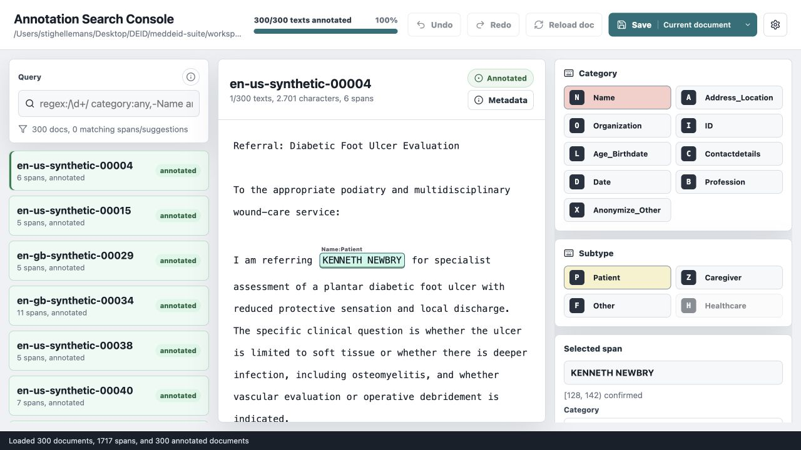

# meddeid-annotate

Local primary-span annotation for canonical MedDeID JSONL. A reviewer can edit
model pre-annotations or annotate from scratch, then save a completed assignment
for training or curation.

See [prepare and annotate data](https://stighellemans.github.io/meddeid/workflows/prepare-and-annotate/)
for the surrounding workflow. This repository remains authoritative for the
annotation application's setup, storage, and interaction contract.

Use `meddeid-curate` to reconcile independent annotation sets and
`meddeid-subannotate` to add core-PII character segments for evaluation.

## Interface preview



The example uses synthetic data. The document list, text reader, label controls,
keyboard shortcuts, and review progress remain visible together during review.

## Browser workspace mode (development)

Start one persistent workspace and import/switch assignments in the browser:

```bash
npm ci
MEDDEID_WORKSPACE_DIR="$PWD/data/workspaces" npm run dev
```

The workspace library accepts canonical JSONL (up to 20 MB), keeps source and
working data separately, resumes each assignment, and downloads ZIP bundles
with progress and provenance. Subannotate requires completed primary annotations.
**Files & results** shows where outputs are saved. Incomplete bundles are marked
as work in progress. ZIP import and guided CSV/Parquet conversion are not included.
Run one application instance per workspace; use separate assignments for reviewers.

Completed assignments are directly available in Curate and Subannotate when all three apps share `MEDDEID_WORKSPACE_DIR`. Use **Workspace → Continue in Subannotate** to start detailed review without curation, or select reviewers through Curate’s **New comparison**. No bundle download is needed between the shared apps.

Workspace controls collapse when you click back into the editor, preserving its full height.

Set `MEDDEID_WORKSPACE_DIR` to enable this mode even when legacy data exists.
Without it, the existing file/data-directory configuration continues to work.
New empty installations open the workspace library by default. For Docker, build
this checkout and mount a persistent directory at `/app/data/workspaces`, setting
`MEDDEID_WORKSPACE_DIR=/app/data/workspaces`. Published 0.3.0 images include
this interface.

## Run locally

Requirements: Node.js 20 or later and npm.

```bash
npm install
MEDDEID_ANNOTATIONS_PATH=/path/to/annotations.jsonl npm run dev
```

The development server binds to `127.0.0.1`. The configured JSONL file is the
current annotation state and is updated in place. It may begin with empty spans
or with predictions produced by `meddeid batch`; reviewers edit, delete, and add
spans through the same interface. A document remains unreviewed until saved.

### Review settings

Settings are stored in the browser for the current origin. **Continue to next
pending document after saving** advances to the next document that is either
unreviewed or has unsaved edits, preferring the current filtered list. The
autosave setting persists valid edits without marking a document reviewed;
review completion always requires an explicit save. Annotation-state tags,
document-text editing, and reader width take effect immediately. **Reset
tracking** preserves all spans and document text while marking every document
unreviewed again.

### Label shortcut configuration

The shipped [`config/label-shortcuts.json`](config/label-shortcuts.json) keeps
the existing Dutch-oriented keyboard bindings. To use bindings suited to
another language or annotation team, copy that file, edit the one-character
keys, and start the app with:

```bash
MEDDEID_LABEL_SHORTCUTS_CONFIG=/path/to/my-label-shortcuts.json \
MEDDEID_ANNOTATIONS_PATH=/path/to/annotations.jsonl npm run dev
```

Category and subtype entries may be omitted when they should remain clickable
and selectable without a keyboard shortcut. Keys are case-insensitive and must
be unique across both maps. Startup fails with a descriptive error for an
unknown taxonomy value, duplicate key, malformed JSON, or unsupported schema
version. This configuration changes only keyboard bindings; the canonical
labels and valid category/subtype combinations still come from
`contracts/taxonomy.json`.

For the released container, mount the custom file read-only and point the same
environment variable at it:

```bash
docker run --rm -p 127.0.0.1:8787:8787 \
  -e MEDDEID_LABEL_SHORTCUTS_CONFIG=/app/custom-label-shortcuts.json \
  -v "$PWD/data:/app/data" \
  -v "$PWD/my-label-shortcuts.json:/app/custom-label-shortcuts.json:ro" \
  ghcr.io/stighellemans/meddeid-annotate:0.3.0
```

## Input contract

Each row contains `document_id`, `text`, canonical `spans`, and optional
`metadata`. Offsets are half-open `[begin, end)` ranges measured in Unicode code
points. Labels and valid subtypes come from `contracts/taxonomy.json`.

Input validation is strict. Every record must use the canonical `document_id`,
`text`, and `spans` fields. Unsupported alternatives such as `doc_id`,
`annotations`, `Category`, and `Subtype` are rejected.

## Docker

The released container is the default route; no source checkout or Node.js
installation is required:

```bash
docker pull ghcr.io/stighellemans/meddeid-annotate:0.3.0
mkdir -p data
cp /path/to/annotations.jsonl data/annotations.jsonl
docker run --rm -p 127.0.0.1:8787:8787 \
  --read-only --cap-drop ALL --security-opt no-new-privileges \
  -v "$PWD/data:/app/data" \
  ghcr.io/stighellemans/meddeid-annotate:0.3.0
```

The container reads and writes `data/annotations.jsonl`. The application does
not provide authentication; keep it on localhost or place it behind an
authenticated TLS reverse proxy that meets your organization’s requirements.

To test an unreleased source change instead, run
`docker build -t meddeid-annotate .` and substitute that image name above.

## Development

```bash
npm test
npm run test:browser
```

Regenerate the JavaScript taxonomy contract after an intentional core-taxonomy
change with `npm run taxonomy:sync`.

## Licence

AGPL-3.0-only.
